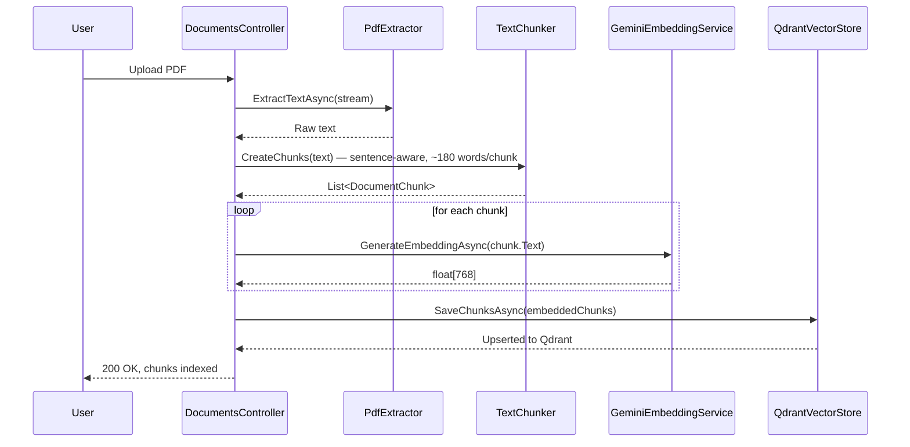
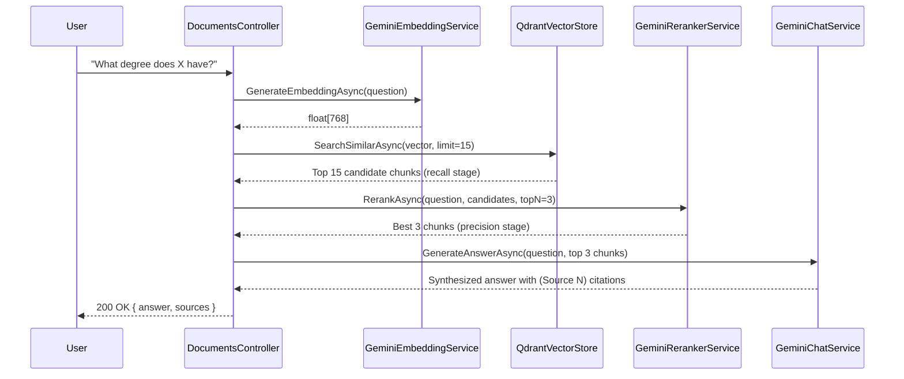

# VectorMind.RagEngine

An enterprise-grade Retrieval-Augmented Generation (RAG) backend built with **C# / .NET 8**, following **Clean Architecture** principles. It ingests PDF documents, converts them into searchable vector embeddings, retrieves the most relevant content for a question, and synthesizes a clear, cited answer using an LLM — the full RAG loop, not just semantic search.

**🔗 Live demo:** [vectormind-ragengine.onrender.com](https://vectormind-ragengine.onrender.com) — redirects straight into interactive Swagger docs.

---

## 🎯 Objective

Large language models can't answer questions about documents they've never seen. RAG solves this by:
1. Breaking a document into small, meaningful chunks
2. Converting each chunk into a vector (a numerical representation of its *meaning*)
3. Storing those vectors in a searchable database
4. At query time, converting the question into a vector, retrieving the most relevant chunks
5. **Reranking** those candidates for true relevance, then **generating** a single coherent, cited answer from them — rather than just returning raw matching text

This project implements that full pipeline as a production-shaped, cloud-deployed backend service.

---

## 🏗️ Architecture

The solution is split into three projects following Clean Architecture — dependencies only ever point inward, toward the Domain layer.

```mermaid
flowchart TB
    subgraph API["VectorMind.RagEngine.Api"]
        Controller["DocumentsController<br/>POST /upload · GET /query"]
        Program["Program.cs<br/>DI Container, Swagger"]
    end

    subgraph Domain["VectorMind.RagEngine.Domain<br/>(zero external dependencies)"]
        IPdf["IPdfExtractor"]
        IChunk["ITextChunker"]
        IEmbed["IEmbeddingService"]
        IVector["IVectorStore"]
        IRerank["IRerankerService"]
        IAnswer["IAnswerGenerationService"]
        Models["Models: DocumentChunk, SearchResult"]
    end

    subgraph Infra["VectorMind.RagEngine.Infrastructure"]
        PdfImpl["PdfExtractor<br/>(PdfPig)"]
        ChunkImpl["TextChunker<br/>(sentence-aware, word-based)"]
        EmbedImpl["GeminiEmbeddingService<br/>(Gemini API, HTTP)"]
        VectorImpl["QdrantVectorStore<br/>(Qdrant, gRPC)"]
        RerankImpl["GeminiRerankerService<br/>(Gemini API, HTTP)"]
        AnswerImpl["GeminiChatService<br/>(Gemini API, HTTP)"]
    end

    Gemini[("Google Gemini API<br/>embeddings + generation + reranking")]
    Qdrant[("Qdrant Cloud<br/>managed vector DB")]

    Controller --> IPdf
    Controller --> IChunk
    Controller --> IEmbed
    Controller --> IVector
    Controller --> IRerank
    Controller --> IAnswer

    PdfImpl -.implements.-> IPdf
    ChunkImpl -.implements.-> IChunk
    EmbedImpl -.implements.-> IEmbed
    VectorImpl -.implements.-> IVector
    RerankImpl -.implements.-> IRerank
    AnswerImpl -.implements.-> IAnswer

    EmbedImpl --> Gemini
    RerankImpl --> Gemini
    AnswerImpl --> Gemini
    VectorImpl --> Qdrant

    style Domain fill:#e8f0fe,stroke:#4285f4
    style Infra fill:#fef7e0,stroke:#f4b400
    style API fill:#e6f4ea,stroke:#34a853
```

**Why this shape matters:** the Domain layer knows nothing about PdfPig, Gemini, or Qdrant — only interfaces. Swap any external dependency (a different embedding provider, a different vector database, a different LLM) and only the Infrastructure layer changes. The Api and Domain layers stay untouched.

---

## 🔄 Pipeline Flow

### Upload flow (`POST /api/documents/upload`)

### Query flow (`GET /api/documents/query`) — two-stage retrieval + generation

---

## 🧰 Tech Stack

| Component | Technology |
|---|---|
| Language & Runtime | C# / .NET 8 |
| Architecture | Clean Architecture (Domain / Infrastructure / Api) |
| PDF Parsing | PdfPig |
| Embeddings | Google Gemini API — `gemini-embedding-2` (768-dim, via `outputDimensionality`) |
| Reranking | Google Gemini API (`gemini-flash-latest`) — LLM-scored relevance over a 15-candidate pool |
| Answer Generation | Google Gemini API (`gemini-flash-latest`) — synthesizes cited answers from top-ranked chunks |
| Vector Database | Qdrant Cloud (gRPC, cosine similarity) |
| API Layer | ASP.NET Core Web API |
| API Docs | Swagger / OpenAPI (Swashbuckle.AspNetCore), togglable in production via `ENABLE_SWAGGER` |
| Containerization | Docker (multi-stage build) |
| Deployment | Render, with environment-driven secrets management |

---

## 📁 Project Structure
