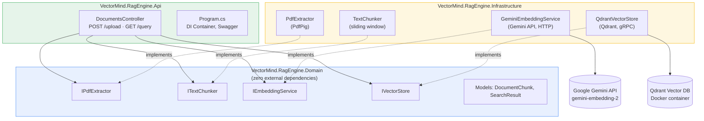
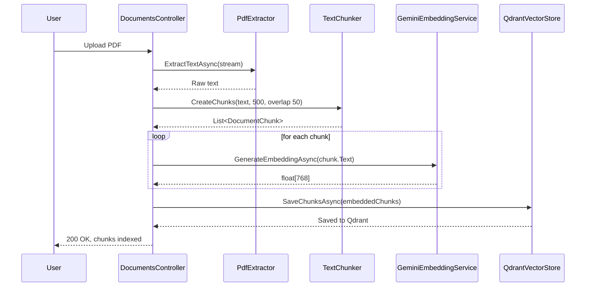
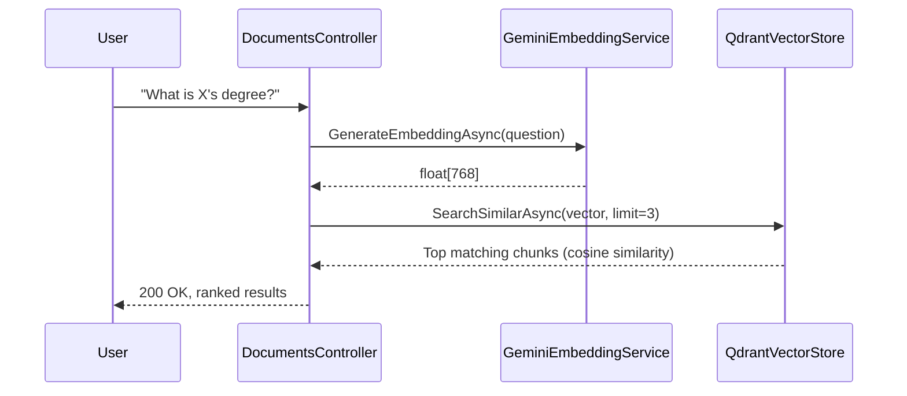

# VectorMind.RagEngine

An enterprise-grade Retrieval-Augmented Generation (RAG) backend built with **C# / .NET 8**, following **Clean Architecture** principles. It ingests PDF documents, converts them into searchable vector embeddings, and exposes a semantic search API so you can ask natural-language questions about the content — without stuffing entire documents into an LLM prompt.

---

## 🎯 Objective

Large language models can't answer questions about documents they've never seen. RAG solves this by:
1. Breaking a document into small, meaningful chunks
2. Converting each chunk into a vector (a numerical representation of its *meaning*)
3. Storing those vectors in a searchable database
4. At query time, converting the question into a vector too, and retrieving the chunks whose meaning is closest to it

This project implements that full pipeline as a production-shaped backend service.

---

## 🏗️ Architecture

The solution is split into three projects following Clean Architecture — dependencies only ever point inward, toward the Domain layer.



**Why this shape matters:** the Domain layer knows nothing about PdfPig, Gemini, or Qdrant — only interfaces. Swap any external dependency (a different embedding provider, a different vector database) and only the Infrastructure layer changes. The Api and Domain layers stay untouched.

---

## 🔄 Pipeline Flow

### Upload flow (`POST /api/documents/upload`)



### Query flow (`GET /api/documents/query`)



---

## 🧰 Tech Stack

| Component | Technology |
|---|---|
| Language & Runtime | C# / .NET 8 |
| Architecture | Clean Architecture (Domain / Infrastructure / Api) |
| PDF Parsing | PdfPig |
| Embeddings | Google Gemini API — `gemini-embedding-2` (768-dim, via `outputDimensionality`) |
| Vector Database | Qdrant (gRPC, cosine similarity), containerized via Docker |
| API Layer | ASP.NET Core Web API |
| API Docs | Swagger / OpenAPI (Swashbuckle.AspNetCore) |

---

## 📁 Project Structure

```
VectorMind.RagEngine/
├── VectorMind.RagEngine.Domain/
│   ├── Models/
│   │   ├── DocumentChunk.cs
│   │   └── SearchResult.cs
│   └── Interfaces/
│       ├── IPdfExtractor.cs
│       ├── ITextChunker.cs
│       ├── IEmbeddingService.cs
│       └── IVectorStore.cs
│
├── VectorMind.RagEngine.Infrastructure/
│   ├── Services/
│   │   ├── PdfExtractor.cs
│   │   ├── TextChunker.cs
│   │   └── GeminiEmbeddingService.cs
│   └── VectorDb/
│       └── QdrantVectorStore.cs
│
└── VectorMind.RagEngine.Api/
    ├── Controllers/
    │   └── DocumentsController.cs
    ├── appsettings.json
    └── Program.cs
```

---

## 🚀 Getting Started

### Prerequisites
- .NET 8 SDK
- Docker Desktop (with WSL 2 backend on Windows)
- A Google Gemini API key ([Google AI Studio](https://aistudio.google.com))

### 1. Start Qdrant

```bash
docker run -d --name qdrant -p 6333:6333 -p 6334:6334 -v "$(pwd)/qdrant_storage:/qdrant/storage" qdrant/qdrant
```

Verify it's running at `http://localhost:6333/dashboard`.

### 2. Configure secrets

In `VectorMind.RagEngine.Api/appsettings.json`:

```json
{
  "Gemini": { "ApiKey": "YOUR_GEMINI_API_KEY" },
  "Qdrant": { "Host": "localhost", "Port": "6334" }
}
```

> 🔒 **Security note:** `appsettings.json` and the local `qdrant_storage/` data folder are both excluded via `.gitignore` in this repo, since they can contain a live API key and raw vector data respectively. If you clone this repo, you'll need to create your own `appsettings.json` locally with the structure above — it will not be present after cloning. For production use, prefer `dotnet user-secrets` or environment variables over a committed config file.

### 3. Run the API

```bash
dotnet run --project VectorMind.RagEngine.Api
```

Swagger UI opens automatically at `https://localhost:<port>/swagger`.

### 4. Try it

- **Upload**: `POST /api/documents/upload` — attach a PDF
- **Query**: `GET /api/documents/query?question=your question here`

---

## ✅ Verified End-to-End

This pipeline has been tested live:
- A real PDF was uploaded, split into 6 chunks, embedded via Gemini, and stored in Qdrant (`pdf_documents` collection, confirmed in the Qdrant dashboard).
- A natural-language question correctly retrieved the single chunk containing the relevant answer, out of six candidates, based on semantic similarity rather than keyword matching.

---

## 🚫 What's Excluded From This Repo

| Path | Why |
|---|---|
| `**/appsettings.json` | Contains a live Gemini API key locally — never committed |
| `qdrant_storage/` | Qdrant's raw runtime database files (created by the `-v` Docker volume mount) — regenerated automatically each time you run the container, not source code |

---

## 🗺️ Known Limitations / Roadmap

- **No similarity scores in query results yet** — `SearchSimilarAsync` currently returns `DocumentChunk` objects without a confidence score, even though the `SearchResult` model exists for this. Planned: return `List<SearchResult>` with cosine similarity scores attached.
- **Raw text extraction lacks word spacing** — PdfPig's raw `page.Text` can concatenate words without spaces depending on the source PDF's layout. Planned: switch to word-level extraction (`GetWords()`) to preserve readable spacing.
- **No persistence guarantee without a volume mount** — running Qdrant without `-v` will lose all vectors on container removal.

---

## 📄 License

Add your license here.
